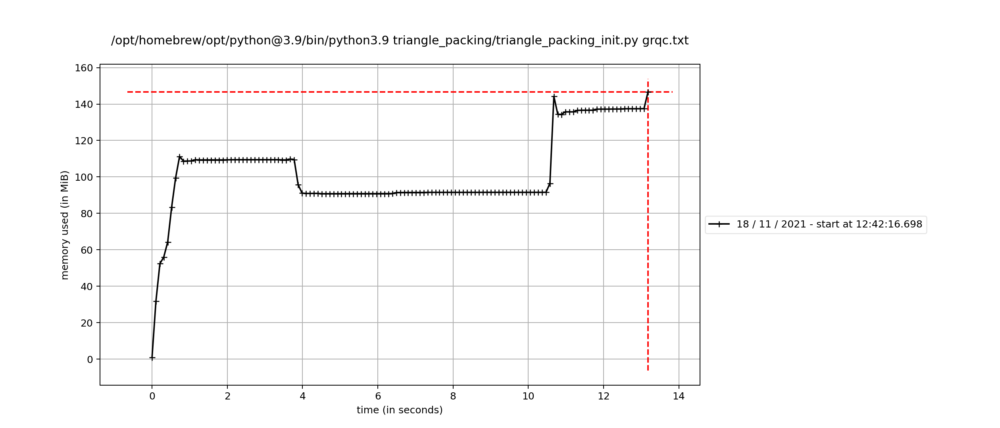
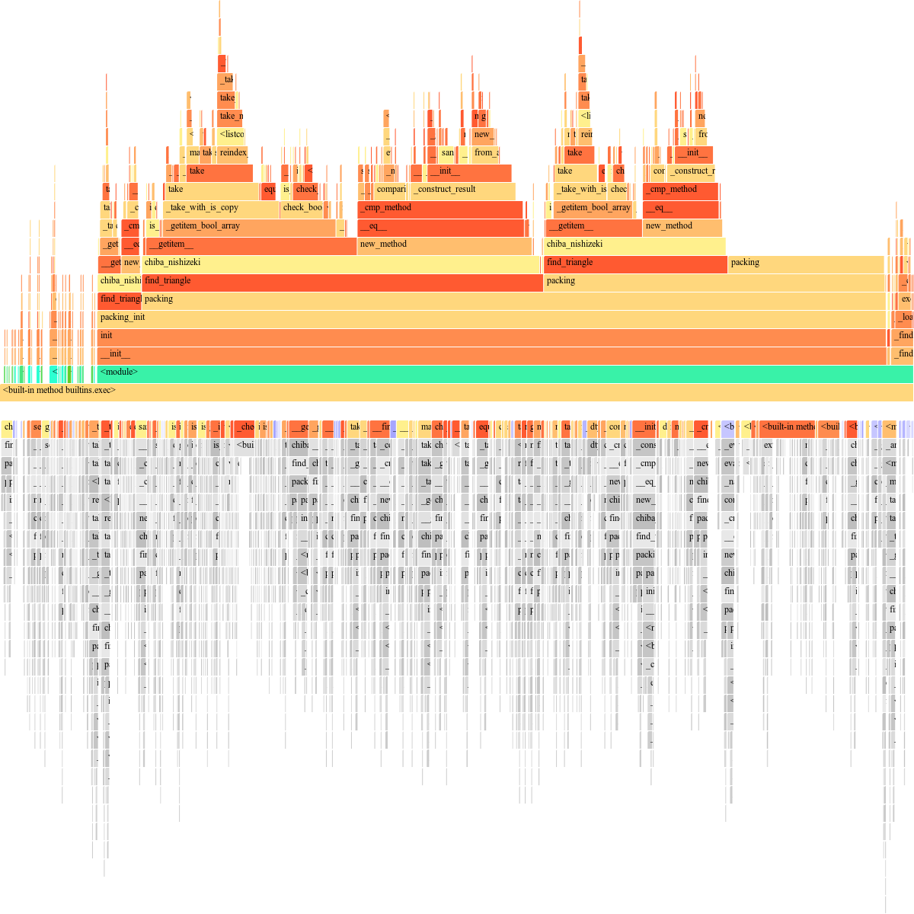
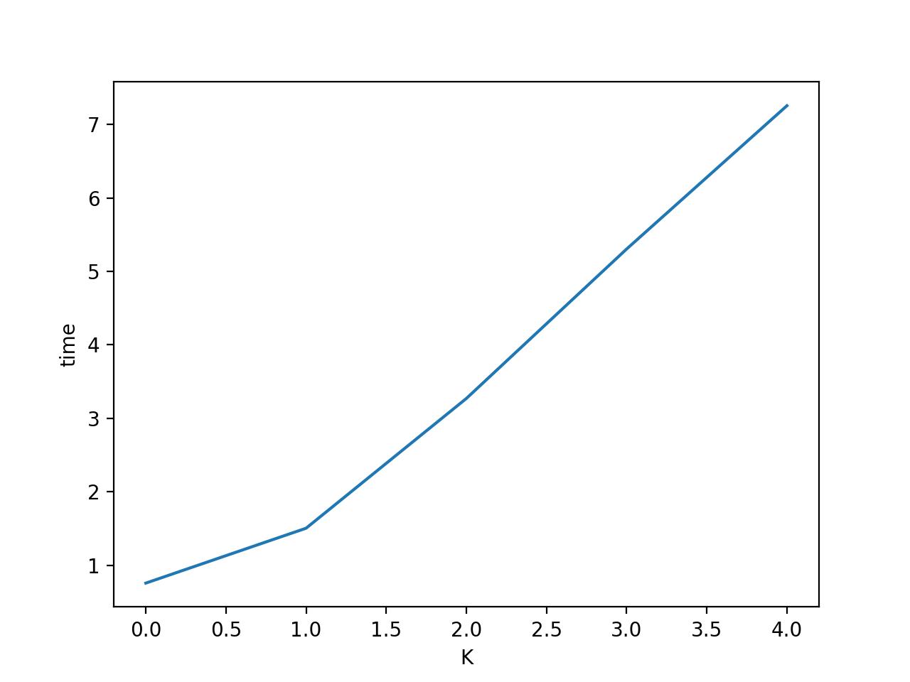

## CS599 Graph Analytics by  **Dr. Charalampos Tsourkakis** At Boston university 
Clone the repository and follow the below given instructions to run the codes


An example format of command you need to run is like the one below

```python3.9 cs599.py <dataset.txt> <operation>```


|   Operation Available	|   Methods Applied   	            |    
|---	|---	                |
|   triangle_packing	|   Color Coding as an FPT problem 	    |
|   find_triangles	|   Chiba Nishizeki Algorithm	    |
|   find_triangles	|   Leapfrog Trijoin Algorithm	    |


|   Methods	|   Outputs  	            |    
|---	|---	                |
|   triangle_packing	|   packing found/ not found 	    |
|   Leapfrog Trijoin	|   number of triangles in the graph	    |
|   Leapfrog Trijoin	|   Flameplots for time analysis of algorithm	    |
|   Leapfrog Trijoin	|   Memory profile plots to analyse the memory occupied at each time instance 	    |
|   Chiba Nishizeki	|   number of triangles in the graph	    |
|   Chiba Nishizeki	|   Flameplots for time analysis of algorithm	    |
|   Chiba Nishizeki	|   Memory profile plots to analyse the memory occupied at each time instance 	    |


**Note**: You will be prompted to select a method for find_triangles operation. Based on the index you select, that method will be applied and you will be able to see the result.


 A **Flame Graph** will appear on firefox browser and **memory profile** will pop up after a while as a pop up


The code will run twice, first time to check the duration of execution and the second time to check how much memory the code is occupying during the execution of the code 


## To find triangle packing for a data 

### Try Executing the following codes mentioned
- For grqc dataset
``` python3.9 cs599.py grqc.txt triangle_packing ```

- For github social
``` python3.9 cs599.py musae_git_edges.csv triangle_packing```

- For web berkstan dataset
```python3.9 cs599.py web-BerkStan.txt triangle_packing```

### About Implemented Algorithm 

 It is a **Fixed parameter tractable problem** with 'K' as the parameter. K stands for the number of colors with which we are randomly coloring the graph L times randomly in the implemented algorithm. 
 
 L = exp(K) for finding the number of monochromatic triangles in a graph colored with K colors.

#### Programming Approach 

The code is applied in a DFS fashion over a tree, where each node of the tree contains all the monochromatic nodes of the graph. 


 ### Problem 2.1: Proof that the implemented algorithm is NP-complete [insert link here]

 We first shown that our problem is first an NP. Then we considered another NP problem 3DP, and shown that it converges to our problem. This way our problem is now NP complete. 

References: 
- [Baldaeung Blogpost](https://www.baeldung.com/cs/prove-np-complete)
- [NP complete problem, partition into triangles](http://profs.sci.univr.it/%7Errizzi/classes/Complexity/provette/Mirko/pt_fine.pdf)

 ### Problem 2.2: Time Complexity and analysis of the algorithm
 
 Number of total combinations of colors we search for finding a triangle in each color = 2^(k)

 at each one colored nodes, we use chiba nishizeki algorithm to find the triangles. Worst case time complexity to find the triangles = O(œ)

 Total time complexity = O(2^k n^3) ≈ O(2^k n^O(1))

 since the time complexity of our algorithm is equivalent to that of a fixed point tractable algorithm as it should be  


### Problem 2.3 Output for different values of 'k' for grqc graph
#### Algorithm output with k = 5, 10, 15, 20


|   K	|   output	            | Runtime (secs)  	| Memory usage (MiB)  	|   
|---	|---	                |---	        |---	            |
|   5	|   Packing found	    |   1.504	    |     79           	|
|   10	|   Packing found	    |   3.271    	|     80         	|
|   15	|   Packing found	    |   5.305     	|     81           	|
|   20	|   Packing found	    |   7.255	    |     82           	|


#### Observations : 

Time complexity of the triangle packing problem will increase exponentially over 'k' and polynomially over 'd' 
- K - Number of colors (Parameter); n - size of data  

as can be seen from the plot below, that the time taken for execution is varying exponentially to find the triangle packing over a fixed data size 'n' as we vary the value of the parameter 'K'

#### Memory profile showing how much memory is the algorithm occupying at each point of time



We can correlate the below flameprof and this memory profile to check which part of the code is occupying more memory as the time scale is same for both plots

#### Flameprof for triangle packing 



#### Observations on time complexity in implementation
We can see from the above plots that most of the time is taken in finding the triangles in the graph by chiba nishizeki algorithm. There we are storing(marking) the explored nodes in a list which is a time taking and memory consuming process. Improvements can be made by hashing them via a dictionary 




#### Observations on memory complexity in implementation
- We started using large chunk of memory ever since the chiba-nishizeki algorithm has started. In the implementation of chiba-nishizeki algorithm, we are storing all the explored nodes in a list, which in python is a time consuming process. It occupies more memory and takes time. 

- This can be mitigated by hashing the explored nodes in a dictionary which will be there in the later update

## Problem 3: Implementation of Triangle finding algorithms
After you execute one of the below commands in terminal, you will be prompted to select one of the two methods specified 

**Chiba Nishizeki** 
    - For more information about this algorithm, please refer to this paper : [Link](http://www.ecei.tohoku.ac.jp/alg/nishizeki/sub/j/DVD/PDF_J/J053.pdf)

#### Time complexity for Chiba Nishizeki 

T = O(alpha * n)

n - number of nodes; 
alpha - arboricity of the graph

The time complexity of Chiba nishizeki Algorithm is polynomial over the size of the graph(number of nodes)

**Leapfrog trijoin** 
    - For more information about this algorithm, please refer to this paper : [Link](https://arxiv.org/abs/1210.0481) 

- For grqc dataset
``` python3.9 cs599.py grqc.txt find_triangles ```

- For github social
``` python3.9 cs599.py musae_git_edges.csv find_triangles```

- For web berkstan dataset
```python3.9 cs599.py web-BerkStan.txt find_triangles```


### Time comparison for different datasets with Chiba Nishizeki and leapfrog trijoin algorithm in the implemented algorithms

|   *Time*	                   | Chiba Nishizeki(Secs)  	|  Leapfrog Trijoin (Query Time)  	|   
|---	                       |---               	        |---	                |   
| **grqc dataset**  	       |         4.5        	    |      5.3            	|   	
| **github social dataset**    |         65             	|      325           	|   	
| **web berkstan dataset**     |                 	        |                   	|   	

### Memory comparison for different datasets with Chiba Nishizeki and leapfrog trijoin algorithm

|  *Memory*                 	|   Chiba Nishizeki	|  Leapfrog Trijoin  	|   	
|---	                        |---	            |---	                |
|  **grqc dataset**  	        |                  	|                   	|   	
|  **github social dataset** 	|   	            |                   	|   	
|  **web berkstan dataset** 	|                	|                    	|   	


