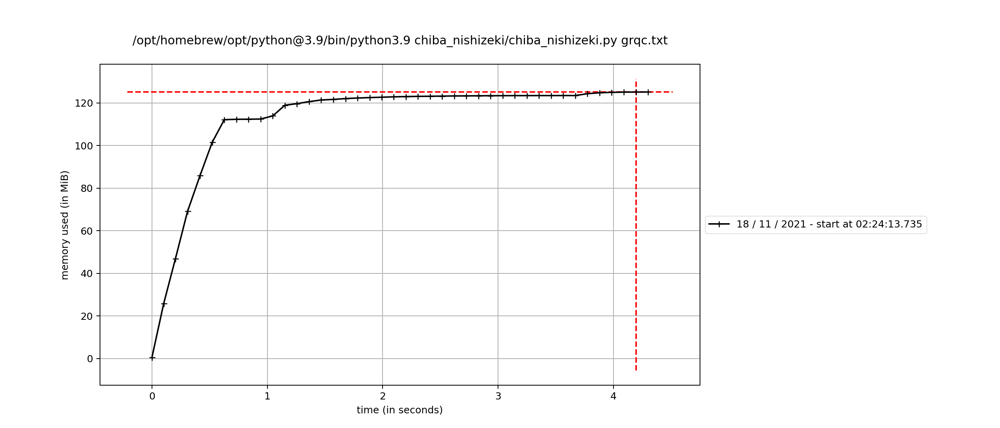
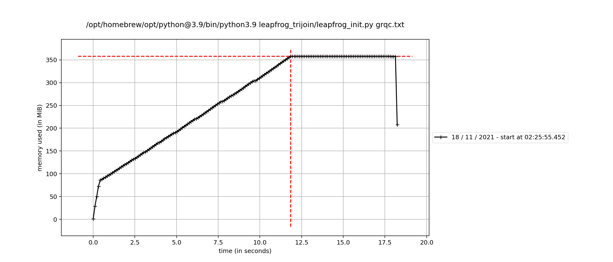
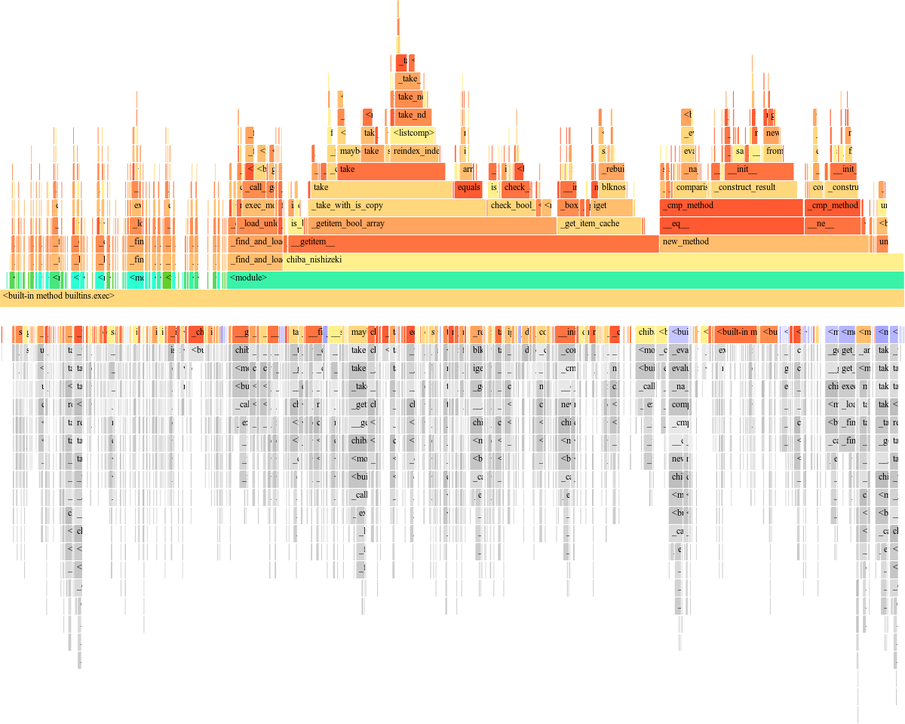
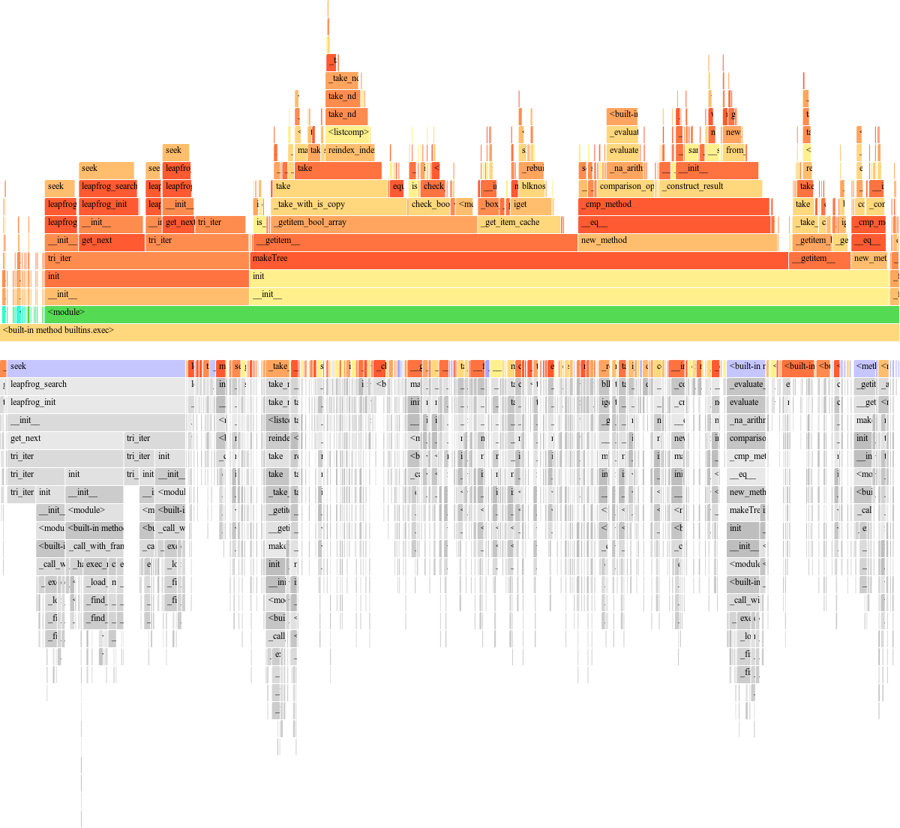
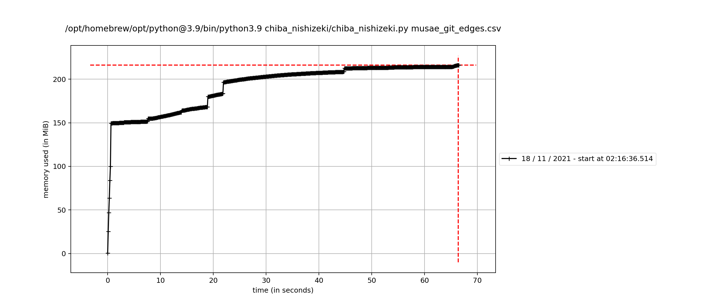
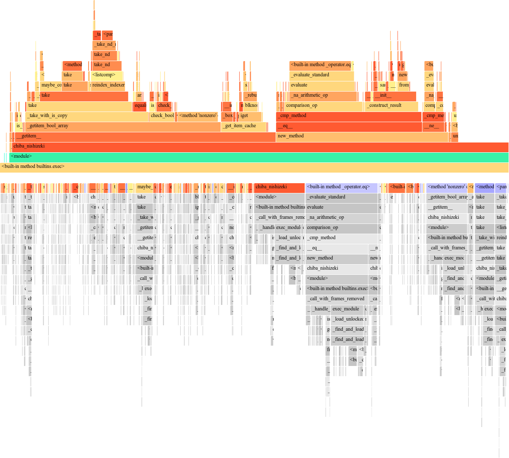

## CS599 Graph Analytics by  **Dr. Charalampos Tsourkakis** At Boston university 
Clone the repository and follow the below given instructions to run the codes


An example format of command you need to run is like the one below

```python3.9 cs599.py <dataset.txt> <operation>```

Other commands you can use 

```python3.9 cs599.py datasets``` - To display the datasets available

``` python3.9 cs599.py help```    - To get help with how to use commands


|   Operation Available	|   Methods Applied   	            |    
|---	|---	                |
|   triangle_packing	|   Color Coding as an FPT problem 	    |
|   find_triangles	|   Chiba Nishizeki Algorithm	    |
|   find_triangles	|   Leapfrog Trijoin Algorithm	    |


|   Methods	|   Outputs  	            |    
|---	|---	                |
|   triangle_packing	|   packing found/ not found 	    |
|   Leapfrog Trijoin	|   number of triangles in the graph	    |
|   Leapfrog Trijoin	|   Flameplots for time analysis of algorithm	    |
|   Leapfrog Trijoin	|   Memory profile plots to analyse the memory occupied at each time instance 	    |
|   Chiba Nishizeki	|   number of triangles in the graph	    |
|   Chiba Nishizeki	|   Flameplots for time analysis of algorithm	    |
|   Chiba Nishizeki	|   Memory profile plots to analyse the memory occupied at each time instance 	    |


**Note**: You will be prompted to select a method for find_triangles operation. Based on the index you select, that method will be applied and you will be able to see the result.


 A **Flame Graph** will appear on firefox browser and **memory profile** will pop up after a while as a pop up


The code will run twice, first time to check the duration of execution and the second time to check how much memory the code is occupying during the execution of the code 


## To find triangle packing for a data 

### Try Executing the following codes mentioned
- For grqc dataset
``` python3.9 cs599.py grqc.txt triangle_packing ```

- For github social
``` python3.9 cs599.py musae_git_edges.csv triangle_packing```

- For web berkstan dataset
```python3.9 cs599.py web-BerkStan.txt triangle_packing```

### About Implemented Algorithm 

#### Problem Analysis
 It is a **Fixed parameter tractable** problem with 'K' as the parameter. K stands for the number of colors with which we are randomly coloring the graph L times randomly in the implemented algorithm. 

 L = exp(K) for finding the number of monochromatic triangles in a graph colored with K colors.


 All Fixed parameter tractable problems are NP-Complete 

#### Programming Approach 

The code is applied in a DFS fashion over a tree, where each node of the tree contains all the monochromatic nodes of the graph. 

We iterate through all the combinations of colors(i.e nodes) until we find a packing. We repeat this 'L' times recoloring the graph at every iteration, so we can get a consistant estimate on the packing. 


 ### Problem 2.1: Proof that the implemented algorithm is NP-complete [insert link here]

 We first shown that our problem is first an NP. Then we considered another NP problem 3DP, and shown that it converges to our problem. This way our problem is now NP complete. 

References: 
- [Baldaeung Blogpost](https://www.baeldung.com/cs/prove-np-complete)
- [NP complete problem, partition into triangles](http://profs.sci.univr.it/%7Errizzi/classes/Complexity/provette/Mirko/pt_fine.pdf)

 ### Problem 2.2: Time Complexity and analysis of the algorithm
 
 Number of total combinations of colors we search for finding a triangle in each color = 2^(k)

 at each one colored nodes, we use chiba nishizeki algorithm to find the triangles. Worst case time complexity to find the triangles = O(œ)

 Total time complexity = O(2^k n^3) ≈ O(2^k n^O(1))

 since the time complexity of our algorithm is equivalent to that of a fixed point tractable algorithm as it should be  


### Problem 2.3 Output for different values of 'k' for grqc graph
#### Algorithm output with k = 5, 10, 15, 20


|   K	|   output	            | Runtime (secs)  	| Memory usage (MiB)  	|   
|---	|---	                |---	        |---	            |
|   5	|   Packing found	    |   1.504	    |     79           	|
|   10	|   Packing found	    |   3.271    	|     80         	|
|   15	|   Packing found	    |   5.305     	|     81           	|
|   20	|   Packing found	    |   7.255	    |     82           	|


#### Observations : 

Time complexity of the triangle packing problem will increase exponentially over 'k' and polynomially over 'd' 
- K - Number of colors (Parameter); n - size of data  

as can be seen from the plot below, that the time taken for execution is varying exponentially to find the triangle packing over a fixed data size 'n' as we vary the value of the parameter 'K'

#### Memory profile showing how much memory is the algorithm occupying at each point of time


We can correlate the below flameprof and this memory profile to check which part of the code is occupying more memory as the time scale is same for both plots

#### Flameprof for triangle packing 


#### Observations on time complexity in implementation
We can see from the above plots that most of the time is taken in finding the triangles in the graph by chiba nishizeki algorithm. There we are storing(marking) the explored nodes in a list which is a time taking and memory consuming process. Improvements can be made by hashing them via a dictionary 


#### Observations on memory complexity in implementation
- We started using large chunk of memory ever since the chiba-nishizeki algorithm has started. In the implementation of chiba-nishizeki algorithm, we are storing all the explored nodes in a list, which in python is a time consuming process. It occupies more memory and takes time. 

- This can be mitigated by hashing the explored nodes in a dictionary which will be there in the later update

## Problem 3: Implementation of Triangle finding algorithms
After you execute one of the below commands in terminal, you will be prompted to select one of the two methods specified 

**Chiba Nishizeki** 
    - For more information about this algorithm, please refer to this paper : [Link](http://www.ecei.tohoku.ac.jp/alg/nishizeki/sub/j/DVD/PDF_J/J053.pdf)

#### Time complexity for Chiba Nishizeki 

T = O(alpha * n)

n - number of nodes; 
[alpha](https://en.wikipedia.org/wiki/Arboricity) - arboricity of the graph

The time complexity of Chiba nishizeki Algorithm is polynomial over the size of the graph(number of nodes)

**Leapfrog trijoin** 
    - For more information about this algorithm, please refer to this paper : [Link](https://arxiv.org/abs/1210.0481) 

- For grqc dataset
``` python3.9 cs599.py grqc.txt find_triangles ```

- For github social
``` python3.9 cs599.py musae_git_edges.csv find_triangles```

- For web berkstan dataset
```python3.9 cs599.py web-BerkStan.txt find_triangles```


### Time comparison for different datasets with Chiba Nishizeki and leapfrog trijoin algorithm in the implemented algorithms

|   *Time* (Secs)                 | Chiba Nishizeki(Secs)  	|  Leapfrog Trijoin (Query Time)  	|   
|---	                       |---               	        |---	                |   
| **grqc dataset**  	       |         4.5        	    |      5.3            	|   	
| **github social dataset**    |         65             	|      325           	|   	
| **web berkstan dataset**     |                 	        |                   	|   	

### Memory comparison for different datasets with Chiba Nishizeki and leapfrog trijoin algorithm

|  *Memory* (MiB)                	|   Chiba Nishizeki	|  Leapfrog Trijoin  	|   	
|---	                        |---	            |---	                |
|  **grqc dataset**  	        |      120            	|      350             	|   	
|  **github social dataset** 	|      200	            |      1400(peak)             	|   	
|  **web berkstan dataset** 	|                	|                    	|  


### Coding procedure for both algorithms and what went wrong in optimization

Below we will be discussing the approach of implementing both the algorithms and see why leapfrog implementation is slow and how it can be optimized 

#### Chiba Nishizeki 
In chiba nishizeki, we are first sorting the nodes of the graph based on their degrees and then applying the iteration algorithm to find the triangles. 

We iterate through the nodes based on their degrees in descending order, and for each node, we do the below process until all nodes are completed. 

**Steps** : 

1) Choose a node

2) look at its neighbors, and mark them (we are storing them in a list in the code as a sign of being marked)

3) look at the neighbors or neighbors. If those neighbors are in the list of marked nodes, then we found a triangle

4) Remove the mark from the first neighbor.

5) Repeat steps 1-4

The implementation is really slow as we are storing all the triangle nodes in a list, and as the number of triangles increases, the algorithm becomes even slower giving us no result at all in time. 

**Improvement** : 
Instead of storing all the triangles in a list, I need to just put a counter and keep adding '1' whenever I find a triangle. Storing them takes a lot of memory and makes the algorithm astronomically slow. This will be implemented in the next update

#### Leapfrog Trijoin 
In leapfrog Trijoin Algorithm, we have an edgelist as an input in the scope of the assignment. But the implemented algorithm here is designed to build and apply leapfrog trijoin algorithm for a tree of any depth.

I implemented this algorithm in four steps. 

1) Given an edgelist, the script makes a tree of multiple nodes. Each node consists of information regarding tis children, parent and peer nodes(nodes at same level)
    - Here Node is another custom defined datatype defined in node.py
    
2) The Tree.py script uses the features of the datatype in node.py and constructs a tree by connecting multiple nodes of the type node. 
    - This part is implemented in a recursive way, and so it takes lot of time as the size of the graph increases making it incredibly slower than it should be. 

3) After constructing the tree, we open the tree which gives us the first node in the child level of the current node, and using that node, you will be able to traverse anywhere in the tree. 

4) lptj.py implements the leapfrog trijoin algorithm, with multiple leapfrog joins that are implemented in 'leapfrog_join.py' 

5) leapfrog_join.py is incredibly fast and can give you intersection of two lists of even really large size, in a matter of few seconds. 

All these point the issue of the implementation being slow to either the way we defined the tree or the trijoin algorithm. 

Since, tree traversal isnt a time taking process and the fact that I implemented trijoin algorithm in recursive way traversing down the tree, point to the recursive method of implementation being at fault for making the whole algorithm show.


#### Ideal Case

In an Ideal Case, the leapfrog trijoin algorithm should be faster than Chiba Nishizeki Algorithm. The improvements in the implementation of leapfrog trijoin algorithm would be updated in this repository soon.


## Comaprison of Performance plots for different datasets. 

### For grqc dataset

#### Memory plots 
Chiba Nishizeki


Leapfrog Trijoin



#### Flame plots 
Chiba Nishizeki


Leapfrog Trijoin


### Observations

[insert text here]


### For musae dataset

#### Memory plots 
Chiba Nishizeki


Leapfrog Trijoin


#### Flame plots 
Chiba Nishizeki


Leapfrog Trijoin


